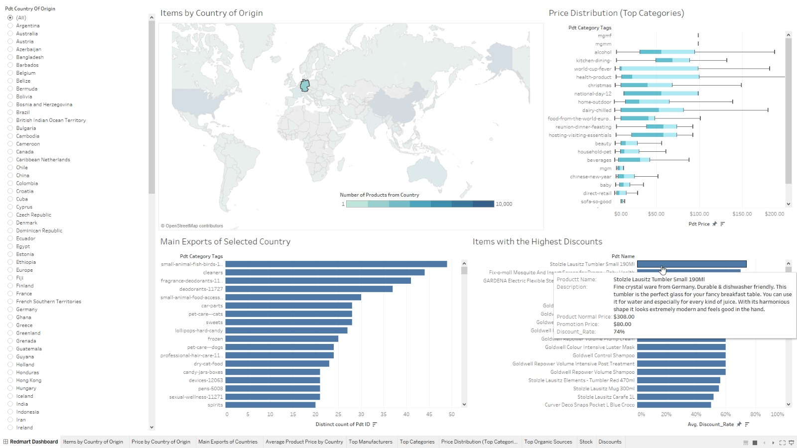
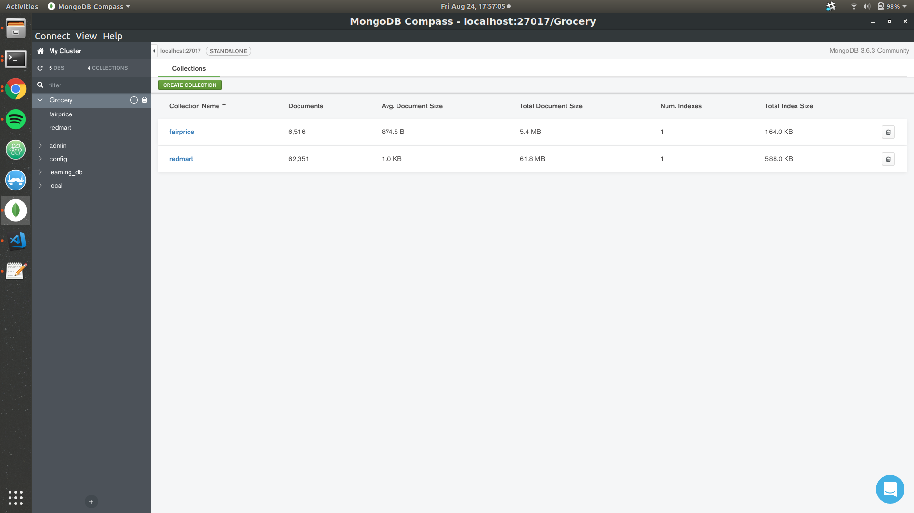

# Grocery Repo
This repo contains scripts to do web scraping of e-commerce grocery web pages. <br>
This is done merely as a school project and we adhere to the robots.txt and ethics of being a [good webscrapper](https://towardsdatascience.com/ethics-in-web-scraping-b96b18136f01). <br>

# Project Directory
The project directory would look something like this after a few rounds of scraping.

```
├── config
├── data
│   ├── fairprice
│   │   └── raw
│   │       └── 20180820_links.csv
│   └── redmart
│       ├── processed
│       │   └── data.csv
│       └── raw
│           ├── 20180809_data.json
│           ├── 20180811_data.json
│           ├── 20180812_data.json
│           ├── 20180813_data.json
│           ├── 20180814_data.json
│           ├── 20180818_data.json
│           └── 20180820_data.json
├── environment.yml
├── LICENSE
├── log
├── notebook
│   ├── FairPrice Exploratory.ipynb
│   ├── MongoDB.ipynb
│   ├── narrative-python.ipynb
│   └── Redmart Exploratory .ipynb
├── pictures
├── README.md
├── report
├── robots
│   ├── fairprice_robots.txt
│   └── redmart_robots.txt
├── seleniumdrivers
│   └── chromedriver
└── src
    ├── fairprice.py
    ├── make_dataset.py
    ├── make_mongodb_redmart.py
    ├── redmart.py
    └── utils.py

```

# Requirements
In order to run the code, you would need to have [Anaconda3](https://www.anaconda.com/download/) installed. 

# Setup
1. Clone the repo
```
git clone https://github.com/notha99y/Grocery.git
```
2. Set up conda environment
```
cd Grocery
conda env create -f=environment.yml
```

With this, you are set to do webscraping and some simple data analysis

# Dockerfile
TODO

# RedMart (How to use)
Currently, these are some of the things you do can with the Redmart Scripts

- Scrape Redmart 
    - This would create a project directory called data/raw, scrapes the redmart webpage and saves it into a .json file
    - This would take roughly 10 mins (depending on your internet speed and redmart servers) The .json file would be rougly 200 MB in size
```
python src/redmart.py
```
The redmart collection is roughly 60 MB in size and have ~ 62,000 unique items
- Extract data into MongoDB
    - This would extract the relevant information from the raw json data and add it into MongoDB. 
    - The extracted data will be saved into a db called Grocery and in a collection called redmart
```
python src/make_mongodb_redmart.py
```
## Tableau Analysis
For those who are familiar with Tableau could connect the MongoDB to Tableau. <br>

[How to connect MongoDB to Tableau](https://www.mongodb.com/tableau)

### Interactive Dashboard
We have came up with an 
[Interactive Dashboard](https://tinyurl.com/redmart-MILE) ( <-- Click )

Go Full Screen for maximum viewing pleasure.

### Screenshot of Dashboard



# FairPrice
The FairPrice Script takes roughly 4 hours to run and would output a .csv file called $TODAY_DATE_links.csv (which contains all the products listing links of fairprice) create collection called fairprice of ~6 MB in size with ~6,500 unique items. <br>
In order to run the script, you would need to do the following:
- Get Selenium Chromedriver [download here](https://chromedriver.storage.googleapis.com/index.html?path=2.41/)
- Unzip the chromedriver
- Set the chrome_driver variable in line 65 of utils.py to the path of your downloaded chromedriver

With these, you are ready to run. The script would given you the following outputs:
- date_links.csv (36 mins): csv file which contains all the product links 
- A Grocery MongoDB with a fairprice collection of product documents

```
python src/fairprice.py
```

### Interactive Dashboard
We have came up with an 
[Interactive Dashboard](https://tinyurl.com/fairprice-MILE) ( <-- Click )

Go Full Screen for maximum viewing pleasure.

# Cold Storage
TODO

# MongoDB
We could run some commands using the MongoDB shell. <br> Alternatively, the default MongoDB GUI called [Compass](https://www.mongodb.com/download-center?jmp=hero#compass) could do the job.  

Screenshot of the GroceryDB and its collections



1. Open MongoDB shell
```
mongo
```
2. Show databases
    - You should see a db called Grocery
```
show dbs
```

3. Show collections
    - This would display the two collections:
        1. fairprice
        2. redmart
```
use Grocery
show collections
```

4. Count Query
    - We can count the number of items in the collections
```
db.redmart.find().count()
```

5. Get Data Size
```
db.redmart.dataSize()
```

6. Drop collections
```
db.redmart.drop()
```